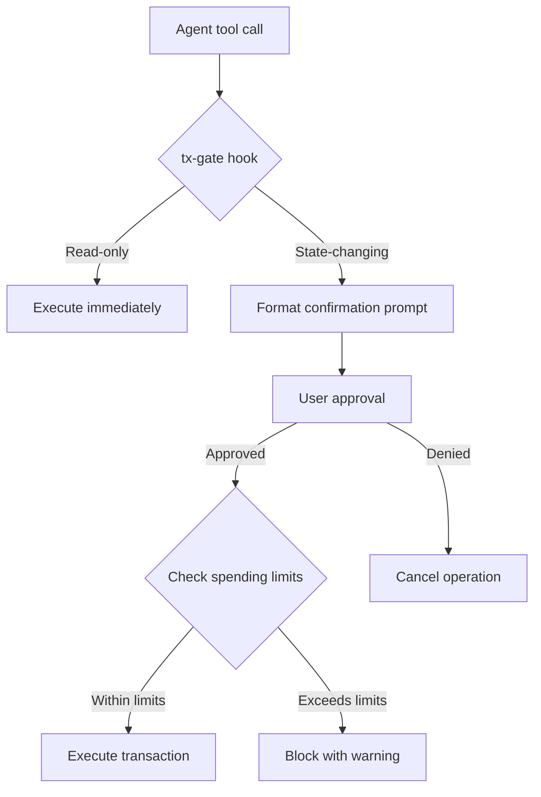

# Transaction Security

CryptoClaw enforces multiple layers of security for all blockchain operations to protect user funds and private keys.

## Confirmation gates

State-changing operations require explicit user confirmation before execution. The tx-gate system intercepts these tool calls via a `before_tool_call` hook.

**Operations requiring confirmation:**

| Tool                     | Action                              |
| ------------------------ | ----------------------------------- |
| `transfer_native_token`  | Send native tokens (BNB, ETH, etc.) |
| `transfer_erc20`         | Send ERC-20 tokens                  |
| `approve_token_spending` | Approve token allowance             |
| `transfer_nft`           | Transfer ERC-721 NFTs               |
| `transfer_erc1155`       | Transfer ERC-1155 tokens            |
| `write_contract`         | Execute arbitrary contract calls    |
| `swap_execute`           | Execute token swaps                 |
| `wallet_delete`          | Remove a wallet                     |
| `agent_register`         | Register agent identity on-chain    |
| `agent_set_wallet`       | Update agent's on-chain wallet      |

When a confirmation is required, the agent presents a human-readable summary of the transaction (recipient, amount, token, network) and waits for your approval.

## Spending limits

Configure per-transaction and daily spending caps in `~/.cryptoclaw/cryptoclaw.json`:

```json5
{
  blockchain: {
    spendingLimits: {
      perTransaction: 100, // Max USD per single transaction
      daily: 1000, // Max USD per 24-hour period
    },
  },
}
```

Transactions exceeding these limits are blocked with a warning.

## Private key protection

- **Encrypted storage**: AES-256-GCM with scrypt KDF (N=2^15, r=8, p=1)
- **Keystore permissions**: File mode `0600` (owner-only access)
- **Transcript redaction**: The `tool_result_persist` hook strips private keys from session transcripts
- **Secret detection**: `containsPrivateKey()` and `sanitizeSecrets()` guard all tool outputs
- **CLI-only operations**: `wallet_import` and `wallet_export` are restricted to the terminal

## Sensitive parameter handling

Parameters like `privateKey`, `passphrase`, and `mnemonic` are in the `SENSITIVE_PARAM_NAMES` list. These are:

- Never logged
- Never included in session history
- Masked in any error messages

## Architecture



## Best practices

- Set conservative spending limits initially and increase as needed
- Use a dedicated wallet for agent operations rather than your main wallet
- Review confirmation prompts carefully before approving
- Use testnet chains (BSC Testnet, Sepolia) for experimentation
