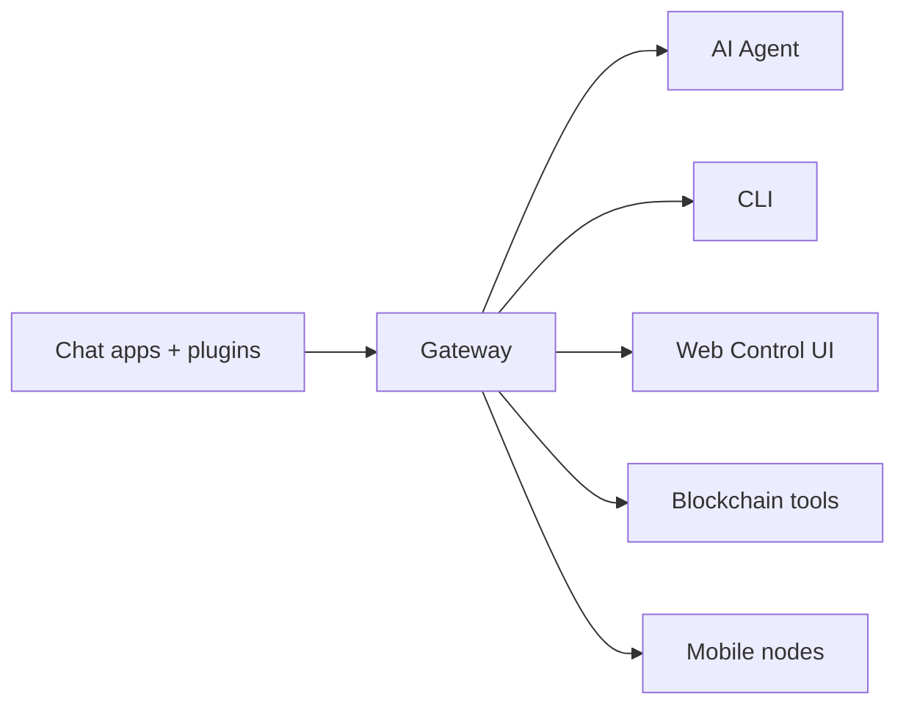

# CryptoClaw

<p align="center">
    
    
</p>

<p align="center">
  <strong>Multi-channel AI assistant with native blockchain capabilities.</strong><br />
  Manage wallets, swap tokens, track portfolios, and chat across WhatsApp, Telegram, Discord, and more.
</p>

<Columns>
  <Card title="Get Started" href="/start/getting-started" icon="rocket">
    Install CryptoClaw and bring up the Gateway in minutes.
  </Card>
  <Card title="Run the Wizard" href="/start/wizard" icon="sparkles">
    Guided setup with `cryptoclaw onboard` and pairing flows.
  </Card>
  <Card title="Blockchain" href="/blockchain" icon="link">
    Wallet management, DeFi, swaps, and multi-chain support.
  </Card>
</Columns>

## What is CryptoClaw?

CryptoClaw is a **self-hosted AI assistant** that combines multi-channel messaging with native blockchain capabilities. It connects your chat apps — WhatsApp, Telegram, Discord, iMessage, and more — to an AI agent that can interact with 16+ EVM-compatible chains.

**Who is it for?** Crypto-savvy developers and power users who want a personal AI assistant for both daily tasks and on-chain operations — without giving up control of their data or private keys.

**What makes it different?**

- **Blockchain-native**: manage wallets, swap tokens, track portfolios, deploy contracts, and more
- **Self-hosted**: runs on your hardware, your rules — private keys never leave your machine
- **Multi-channel**: one Gateway serves WhatsApp, Telegram, Discord, and more simultaneously
- **Agent-native**: built for coding agents with tool use, sessions, memory, and multi-agent routing

**What do you need?** Node 22+, an API key (Anthropic recommended), and 5 minutes.

## How it works



The Gateway is the single source of truth for sessions, routing, channel connections, and blockchain operations.

## Key capabilities

<Columns>
  <Card title="Multi-channel gateway" icon="network">
    WhatsApp, Telegram, Discord, and iMessage with a single Gateway process.
  </Card>
  <Card title="Wallet management" icon="wallet">
    Create, import, and manage encrypted wallets across 16+ EVM chains.
  </Card>
  <Card title="Token swap" icon="arrow-left-right">
    Swap on PancakeSwap and Uniswap with slippage protection.
  </Card>
  <Card title="DeFi & portfolio" icon="bar-chart-3">
    Monitor DeFi positions, track holdings, and discover yields.
  </Card>
  <Card title="Smart contracts" icon="file-code">
    Deploy, call, and verify contracts. Mint and manage NFTs.
  </Card>
  <Card title="Transaction security" icon="shield">
    Confirmation gates, spending limits, and key redaction.
  </Card>
  <Card title="Web Control UI" icon="monitor">
    Browser dashboard for chat, config, sessions, and nodes.
  </Card>
  <Card title="Mobile nodes" icon="smartphone">
    Pair iOS and Android nodes with Canvas support.
  </Card>
</Columns>

## Quick start

<Steps>
  <Step title="Install CryptoClaw">
    ```bash
    npm install -g @termix-it/cryptoclaw
    ```
  </Step>
  <Step title="Onboard and install the service">
    ```bash
    cryptoclaw onboard --install-daemon
    ```
  </Step>
  <Step title="Pair WhatsApp and start the Gateway">
    ```bash
    cryptoclaw channels login
    cryptoclaw gateway --port 18789
    ```
  </Step>
</Steps>

Need the full install and dev setup? See [Quick start](/start/quickstart).

## Dashboard

Open the browser Control UI after the Gateway starts.

- Local default: http://127.0.0.1:18789/
- Remote access: [Web surfaces](/web) and [Tailscale](/gateway/tailscale)

## Configuration (optional)

Config lives at `~/.cryptoclaw/cryptoclaw.json`.

- If you **do nothing**, CryptoClaw uses the bundled agent in RPC mode with per-sender sessions.
- If you want to lock it down, start with `channels.whatsapp.allowFrom` and (for groups) mention rules.

Example:

```json5
{
  channels: {
    whatsapp: {
      allowFrom: ["+15555550123"],
      groups: { "*": { requireMention: true } },
    },
  },
  messages: { groupChat: { mentionPatterns: ["@cryptoclaw"] } },
}
```

## Start here

<Columns>
  <Card title="Blockchain" href="/blockchain" icon="link">
    Wallet management, DeFi, swaps, NFTs, and multi-chain support.
  </Card>
  <Card title="Configuration" href="/gateway/configuration" icon="settings">
    Core Gateway settings, tokens, and provider config.
  </Card>
  <Card title="Remote access" href="/gateway/remote" icon="globe">
    SSH and tailnet access patterns.
  </Card>
  <Card title="Channels" href="/channels/telegram" icon="message-square">
    Channel-specific setup for WhatsApp, Telegram, Discord, and more.
  </Card>
  <Card title="Nodes" href="/nodes" icon="smartphone">
    iOS and Android nodes with pairing and Canvas.
  </Card>
  <Card title="Help" href="/help" icon="life-buoy">
    Common fixes and troubleshooting entry point.
  </Card>
</Columns>

## Learn more

<Columns>
  <Card title="Full feature list" href="/concepts/features" icon="list">
    Complete channel, routing, blockchain, and media capabilities.
  </Card>
  <Card title="Multi-agent routing" href="/concepts/multi-agent" icon="route">
    Workspace isolation and per-agent sessions.
  </Card>
  <Card title="Security" href="/gateway/security" icon="shield">
    Tokens, allowlists, and safety controls.
  </Card>
  <Card title="Troubleshooting" href="/gateway/troubleshooting" icon="wrench">
    Gateway diagnostics and common errors.
  </Card>
  <Card title="About and credits" href="/reference/credits" icon="info">
    Project origins, contributors, and license.
  </Card>
</Columns>
