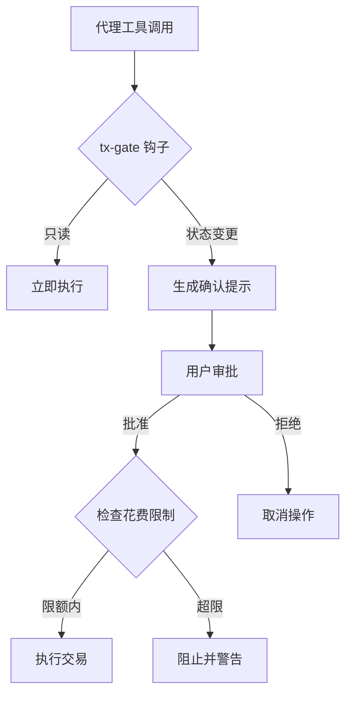

# 交易安全

CryptoClaw 对所有区块链操作执行多层安全措施，保护用户资金和私钥。

## 确认门控

状态变更操作在执行前需要用户明确确认。tx-gate 系统通过 `before_tool_call` 钩子拦截这些工具调用。

**需要确认的操作：**

| 工具                     | 操作                        |
| ------------------------ | --------------------------- |
| `transfer_native_token`  | 发送原生代币（BNB、ETH 等） |
| `transfer_erc20`         | 发送 ERC-20 代币            |
| `approve_token_spending` | 授权代币额度                |
| `transfer_nft`           | 转移 ERC-721 NFT            |
| `transfer_erc1155`       | 转移 ERC-1155 代币          |
| `write_contract`         | 执行合约写入                |
| `swap_execute`           | 执行代币兑换                |
| `wallet_delete`          | 删除钱包                    |
| `agent_register`         | 注册链上代理身份            |
| `agent_set_wallet`       | 更新代理链上钱包            |

需要确认时，代理会展示人类可读的交易摘要（接收方、金额、代币、网络），等待您的批准。

## 花费限制

在 `~/.cryptoclaw/cryptoclaw.json` 中配置单笔和每日花费上限：

```json5
{
  blockchain: {
    spendingLimits: {
      perTransaction: 100, // 单笔最大 USD
      daily: 1000, // 24 小时最大 USD
    },
  },
}
```

超限交易将被阻止并显示警告。

## 私钥保护

- **加密存储**：AES-256-GCM，scrypt KDF（N=2^15, r=8, p=1）
- **密钥库权限**：文件模式 `0600`（仅所有者可访问）
- **对话脱敏**：`tool_result_persist` 钩子从会话记录中去除私钥
- **密钥检测**：`containsPrivateKey()` 和 `sanitizeSecrets()` 守护所有工具输出
- **仅 CLI 操作**：`wallet_import` 和 `wallet_export` 仅限终端

## 架构



## 最佳实践

- 初始设置保守的花费限制，按需调高
- 为代理操作使用专用钱包，而非主钱包
- 仔细审查确认提示后再批准
- 使用测试网（BSC Testnet、Sepolia）进行实验
